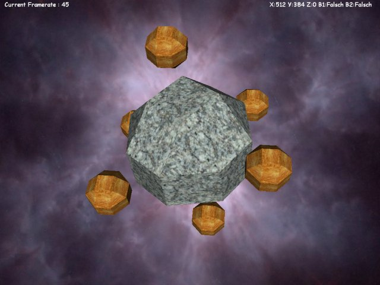



## DirectX8 VB Example \(Class V1\.1\!\)

### Description

V1.1 Now! i have fixed Auto ScreenMode Selection.

My V1.0 DX8 Class Module is now finished :) !

Here is a nice (i think) example, what u can do with it.

There not really all functions i could implement,

but with this Version u can start play around with DX8 and my Class :).

Modify it as u like - it contains : Auto Screen Mode Detect, Light, Texture, Custom Meshes, Transforms, Background, MousePointer ...

Sorry for the less Comments in Code, but havent got much time to write a nice Doc.

have fun ...

PS: if u Vote for me, the functions will be more in next Version (and a Doc maybe) :P

(if something not working, plz leave a message)
 
### More Info
 

             |
---                |---
**Submitted On**   |2001-10-30 07:30:34
**By**             |[Thanatos](https://github.com/Planet-Source-Code/PSCIndex/blob/master/ByAuthor/thanatos.md)
**Level**          |Intermediate
**User Rating**    |4.9 (49 globes from 10 users)
**Compatibility**  |VB 5\.0, VB 6\.0
**Category**       |[DirectX](https://github.com/Planet-Source-Code/PSCIndex/blob/master/ByCategory/directx__1-44.md)
**World**          |[Visual Basic](https://github.com/Planet-Source-Code/PSCIndex/blob/master/ByWorld/visual-basic.md)
**Archive File**   |[DirectX8 V3188510302001\.zip](https://github.com/Planet-Source-Code/thanatos-directx8-vb-example-class-v1-1__1-28507/archive/master.zip)

